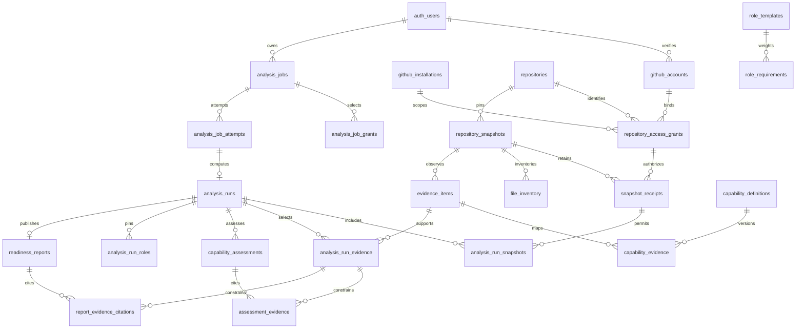

# ADR 0002: Private evidence persistence, ownership, and retention

Status: accepted for Run 02, September 13, 2026. Requirements: CORE-003–004, ANA-002–003, ANA-005–007, CONS-006. This delivers the persistence boundary; provider verification, durable execution, semantic analysis, and product rollout remain separate runs.

## Ownership and canonical observations

Stable GitHub provider IDs are decimal strings, with a globally unique provider identity per application account. An account may verify several identities. Login is mutable display metadata. Linking checks both the new identity table and existing verified `github_tokens.github_user_id` associations; existing OAuth credentials are not copied into new tables. Run 04 must integrate the verified provider flow with these bindings, not treat caller-supplied login text as authority.

Installations and repositories are canonical identities. Access requires a user-specific grant binding user, verified identity, installation, repository, read-only permission, and attestation/version/time. Every write checks the active identity/installation/grant in the transaction and locks those records against concurrent revocation. Installation ownership or a guessed repository/snapshot UUID is insufficient.

An authorized ingestion/reuse records `snapshot_receipts(user_id, snapshot_id, grant_id)`. A run can attach only receipts bound to its original job grants. Reusable file/evidence rows remain internal. Different users may reference the same canonical snapshot only after independently verified ingestion/reuse through their own grant and receipt. No endpoint exposes canonical snapshots merely because they exist.

## Versions, publication, and database integrity

A snapshot identity includes repository, exact commit SHA, observed visibility, snapshot identity version, extraction policy version, extractor bundle, detector bundle, and coverage version. A new SHA, policy, visibility, or extraction dependency creates another artifact. Branch is encrypted immutable provenance for the first ingestion of that canonical artifact; it is not re-resolved on retry. Run 06 must additionally record each retrieval's selected/resolved branch when it reuses an existing artifact reached through another branch.

The store operation seals a complete snapshot's inventory/coverage/observations in one transaction. A canonical conflict returns the existing snapshot ID and creates the caller's authorized receipt; it never replaces observations. Callers must use that canonical identity and persisted observations, not newly generated evidence IDs from a discarded duplicate bundle. Owner-scoped export currently includes retained snapshot/observation data; Run 06 should add a narrowly scoped worker projection if more efficient canonical reuse reads are needed. No unscoped service-role table access should be introduced for this.

Logical jobs have unique `(user_id, idempotency_key)` and store the canonical request hash. Identical live request replay returns the existing job; different payload/hash raises `IDEMPOTENCY_CONFLICT`. The operation is implicitly Feature 1 analysis creation because it has its own table. Deletion removes this key along with the job; Run 07 must define longer-lived deletion tombstones if billing/replay retention needs them.

Attempts are distinct from runs. Runs pin the complete Run 01 version-dependency object, an ordered snapshot-set digest, relational snapshot memberships, and all five role versions. Run payloads are immutable from creation; terminal status lives in `analysis_run_status`. Jobs/attempts have checked terminal transitions. Run 02 creates one execution attempt from a queued job; retries, leases, fencing, progress updates, billing, and workspace cancellation are **not implemented** by the existence of these tables.

Finalization requires the owner, a running job/run, active grants, matching pinned snapshots/coverage/versions, exact stored evidence observations, valid taxonomy/group mappings, and applicable role requirements. A verified claim needs mapped evidence support for every claimed capability. All nested `evidenceIds` become relational `report_evidence_citations`; assessed capability edges also reference `capability_evidence`. Thus prose or an improvement cannot bypass membership checks by burying an ID in JSON. Report and capability references use composite FKs to the same run/taxonomy. One report is allowed per job and per run.

Cross-reference FKs are deferred until transaction commit so account/analysis deletion can complete every cascade before integrity is checked. Failed FK checks roll back the entire publishing transaction, including payload, citations, assessments, statuses, and audit entry. API callers must await the RPC's committed response; they must not treat a statement result inside a still-open transaction as published. PostgreSQL documents this distinction in [SET CONSTRAINTS](https://www.postgresql.org/docs/17/sql-set-constraints.html).

Strict shared Zod schemas validate backend input and returned reports. Database checks establish relational provenance, ownership, version coherence, and immutable history. They do not prove that prose accurately summarizes code, labels are appropriately redacted, strength/confidence is calibrated, or analysis is semantically complete. Those gates remain required in Runs 08–12 before invoking finalization in a production worker. No permissive implementation of the full `ReadinessDomainValidator` is supplied here.

## Access policy matrix

| Surface | Anonymous | Authenticated owner | Other authenticated user | Backend service role |
|---|---|---|---|---|
| Accounts, grants, jobs, attempts, runs, reports, safe audit rows | No SELECT privilege | Own rows through RLS | Zero rows | No direct table access; explicit actor-scoped RPCs |
| Run snapshots/roles/evidence, assessments and citation edges | Denied | Own run memberships through RLS | Zero rows | RPCs only |
| Canonical repositories/installations/snapshots, files/evidence, receipts, taxonomy/role storage, model records | Denied | No direct access | No direct access | No direct access; vetted RPCs or reviewed versioned migrations |
| Mutation/finalization/export RPCs | No execute | No execute | No execute | Execute with verified actor parameter; maintenance has no actor |
| `feature_one_owns_run` | No execute | Boolean for own run | False for foreign/missing run | Execute; policy helper |

Browser roles cannot submit foreign FKs, so constraint error details cannot serve as an existence oracle. Owner report reads use `(actor, report_id)` inside the database and return null for missing/foreign IDs; lists scope by actor. Deletion/revocation return the same successful void response for absent/foreign IDs. The TypeScript repository never forwards/logs SQL detail, private rows, or network error contents.

All tables enable RLS, but RLS alone does not constrain BYPASSRLS roles or protect against FK-based information leaks. We explicitly revoke direct service-role table privileges and PUBLIC function execution, use SECURITY DEFINER RPCs with an empty search path, and grant browser SELECT only for owner-scoped projections. These choices follow [PostgreSQL's row-security behavior](https://www.postgresql.org/docs/17/ddl-rowsecurity.html). The schema owner remains a privileged deployment operator who could deliberately alter permissions/triggers; ordinary service operations cannot rewrite completed content.

## Private locator encryption

Retain only relative file paths, optional symbols/line ranges, or a bounded provider-object locator with its SHA relationship. Inventory retains language/size/classification/exclusion codes, never source bytes. Branch names and any future retained repository name metadata are encrypted too. Stable provider IDs remain internal identifiers; the verified login is visible only to its owning account. Retaining source excerpts, raw blobs, tokens, archives, arbitrary model prompts, or raw model output in these rows is prohibited.

`LocatorCrypto` encrypts with AES-256-GCM, a fresh random 12-byte IV, and a 16-byte authentication tag. AAD binds purpose, key version, repository, snapshot and locator IDs, so swapping rows/purposes fails authentication. The envelope is `v1.<key-semver>.<iv-base64url>.<tag-base64url>.<ciphertext-base64url>`. Node's [crypto documentation](https://nodejs.org/docs/latest-v22.x/api/crypto.html) describes unpredictable IVs and GCM authentication; tests cover round trips, tampering, row/purpose substitution, and key rotation.

Lookup fingerprints are repository-scoped HMAC-SHA256 using a **separate** 32-byte key, never an ordinary hash of a guessable private path. Fingerprints and ciphertext stay internal and are removed from account exports. The keyed lookup does not authorize access or prove content truth. Per-detector/per-locator uniqueness currently deduplicates observations; later detector contracts must consolidate observations or define new locator/fingerprint semantics under a new version when needed.

`EVIDENCE_LOCATOR_KEY_VERSION`, `EVIDENCE_LOCATOR_ENCRYPTION_KEY`, and `EVIDENCE_FINGERPRINT_KEY` are read lazily by the future worker's secret provider. Both keys must be independent 32-byte hex values; do not reuse the existing OAuth token encryption key. Production keys belong in a managed secret/KMS service, not repository files, database rows, logs, CI fixtures, or browser configuration. Disabled backend startup does not require these keys.

The crypto class accepts a versioned injected keyring. New writes use the active key; retain old keys while immutable artifacts or recoverable backups need them. Changing an environment key under an existing version breaks decryption. This run does not install KMS infrastructure or a ciphertext rewrite job. Production API and worker factories load retained read keys from optional `EVIDENCE_LOCATOR_READ_KEYS`, a managed-secret JSON array of `{version,encryptionKey,fingerprintKey}` entries. Keys are independent 32-byte hex values; the array permits at most 32 unique non-active versions and 16 KiB. Invalid configuration fails closed without exposing its contents. Rotation uses a new active version plus retained old keys; follow the overlap procedure in the [operations runbook](../analysis-worker-operations.md#run-16-release-and-incident-procedure). Irreversible key removal must follow the deployment's documented backup/retention process.

Owner reports contain sanitized labels/optional line ranges rather than internal locators. They remain owner-only and immutable. Later generalized/public projections require separate disclosure validation and are not introduced here.

## Deletion, revocation, and audit retention

| Event/data | Decision |
|---|---|
| GitHub grant/identity revoked or installation suspended | Block new ingestion/reuse, new runs, and finalization. Completed private results remain readable/exportable by their original owner until deletion; this never authorizes new source retrieval |
| Analysis deleted | Atomically remove job, attempts, runs, report, citation/assessment edges and model records; remove its otherwise-unused receipts; prune canonical observations only after all legitimate references disappear |
| Shared canonical observation | A user's deletion never returns or reveals other references. A surviving receipt/run prevents canonical deletion; receipt FKs cannot be cascaded away by cleanup |
| Account deleted | Existing Auth deletion cascades new identity/grant/job/data records. Deferred cleanup runs after all cascades; tests cover pending/completed jobs and another user's shared snapshots |
| Unattached ingestion receipt | Retain at most the 24-hour recovery window when maintenance runs, then prune if no run references it. Run 07 must bind ongoing work and schedule cleanup/retries |
| Job canceled | Terminal status prevents finalization; results are not published. Retained analysis records remain owner-deletable. Raw workspace cancellation/cleanup is Run 07 |
| Audit events | Only actor/object/request UUIDs, enumerated actions, timestamps, and bounded counts. Analysis deletion leaves minimal action history without names/source; account deletion removes it; maintenance removes events older than 90 days |
| Model observability | Token/cost/latency counters, provider/model/schema/prompt version, keyed input fingerprint, validation status, optional legacy `api_usage` reference. No input/output text. Owned rows cascade with attempts; existing aggregate API usage retains no new user/source payload |
| Future finding feedback | Run 15 must FK to owner/report/job with deletion cascades; do not change completed content. Existing generic feedback already cascades on account deletion and is not repurposed |
| Backups/provider data | No infrastructure/provider purge interval is asserted. Deployment owners must document backup retention/restoration and provider handling before rollout; restore procedures must reapply deletions and preserve key access restrictions |

Exports add `evidence_analysis`: owned identity/installations/repositories/grants, receipt metadata, retained snapshot metadata/coverage/inventory, safe file metadata/observations, jobs/attempts/runs/memberships/reports, safe audit data and model usage fields. Credentials, raw source, encrypted locators, and keyed lookup values are excluded. This is an owner export, not a disclosure-safe public projection.

See [database operations](../database.md) for migration order, deployment sequencing, tests and forward recovery. All feature flags remain false; legacy saved reports/profiles/advice/credits are preserved.
